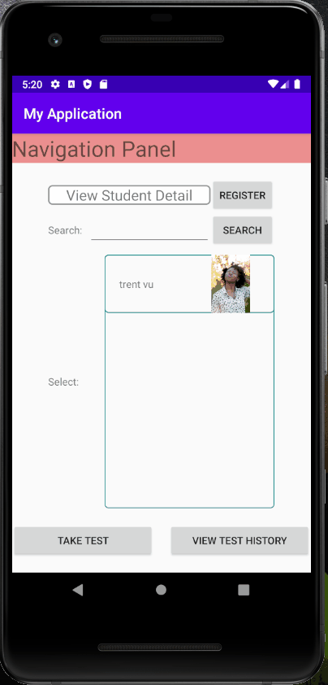
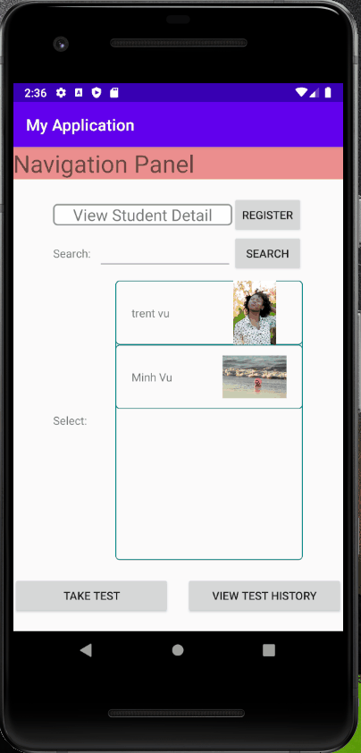
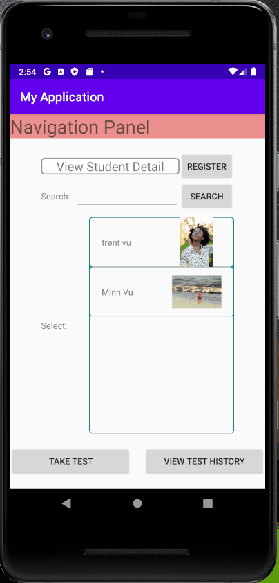
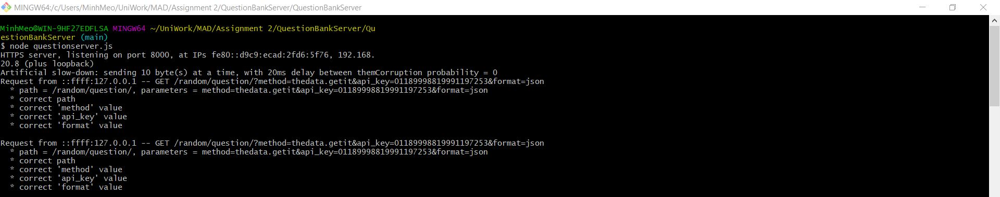

# Overview
An android application that provides a platform for students to take math test online.

The application also allows user to register as many student entries as requested in the SQLite database.

The Math Tester retrieves questions randomly from a remote question bank server, which for testing purpose would be attached along with the app repository. Hence, the app is designed to fetch data specfically from the provided server file.

=> **Users can freely use their own server with modification to source code required.
# Demo
Math Tester's 3 main features:

        

**Server logs should indicate something familiar:


# Installation
If you haven't installed Node.JS on your system, visit https://nodejs.org/en/download/ to install the software.

Once installed, navigate to QuestionBankServer inside your local repo and run the server
```bash
cd /Math-Tester/QuestionBankServer/QuestionBankServer
node questionserver.js
```
After the server is fired up and running, open the android application on a targeted API-28 android device emulator such as PIXEL 2 from an android IDE like Android Studio.
# Usage
The app is android-based and hence, has a very intuitive user interface. User can easily navigate through each feature of the online teser on the android screen.
# Contributing
I'm fairly new to Github but any pull request are welcomed. For major changes, please contact me or open an issue first so we can discuss further more on the improvements.

Would love some feedbacks from everyone 👨‍💻👩‍💻🙆‍♂️✅!
